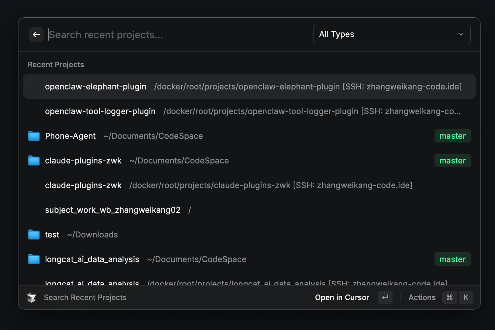
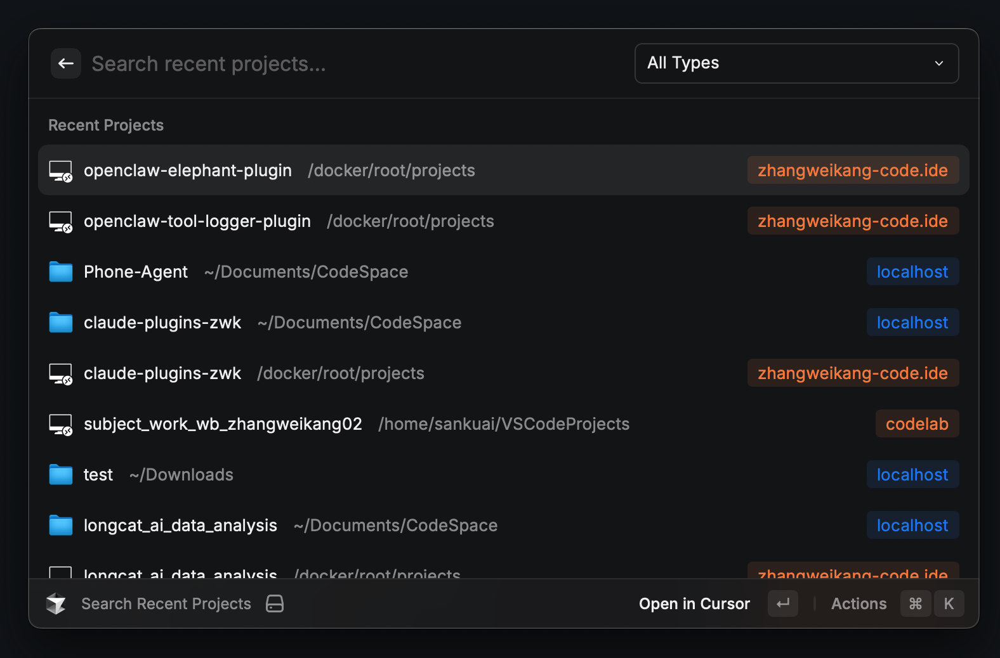
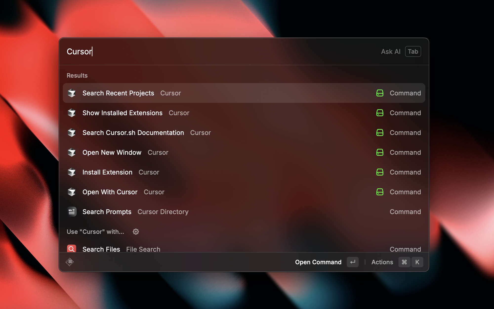

# Cursor

Control Cursor directly from Raycast

本项目在官方 [cursor-recent-projects](https://www.raycast.com/degouville/cursor-recent-projects) 插件基础上进行了以下优化：

## 优化说明

**优化前后对比：**

优化前：



优化后：



### 1. 远程项目图标优化

官方插件中，远程项目（SSH 连接的项目）在列表最左侧没有图标显示，导致与本地项目在视觉上难以区分。本次优化为远程项目添加了电脑（显示器）图标，使远程项目与本地项目一目了然。

| 优化前 | 优化后 |
|--------|--------|
| 远程项目无图标 | 远程项目显示电脑图标 |

### 2. 项目路径与主机名显示优化

官方插件将项目路径和主机名拼接在项目名称后面，当路径较长时，主机名会被截断或无法显示，界面显得杂乱。

本次优化将显示方式调整为：
- **项目名称后**：仅显示项目路径
- **右侧标签**：显示主机名（替换原来的分支名）

相比分支名，主机名在日常使用中更为重要——尤其是同时连接多台远程服务器时，能快速识别项目归属的机器。因此将主机名提升到更显眼的右侧标签位置，使界面信息优先级更合理。

---

## 安装说明

1. 安装依赖：
   ```bash
   npm install
   ```

2. 构建扩展：
   ```bash
   npm run build
   ```

3. 在 Raycast 中运行 "Import Extension"，然后选择此项目文件夹

---

[![raycast-cross-extension-badge]][raycast-cross-extension-link]



## What is this extension

- Search Cursor Recent Projects
- Use `Open With Cursor` command
- Use `Open New Window` command
- Show Installed Extensions list
- Search & Install Extension from VSCode Marketplace
- Reach and search the Cursor Documentation in an instant right from Raycast without any hassle.

## API

This extensions follows [Raycast Cross-Extension Conventions][raycast-cross-extension-link].

You can use `crossLaunchCommand` to use its result.

### Launch Context Options

#### `cursorDirectory`

This parameter is designed for the [Cursor Directory](https://raycast.com/escwxyz/cursor-directory) extension.

Type: `{ruleContent: string; replace?: boolean}`

- `ruleContent` is required for this feature.
- `replace` default to `true`. It determines whether to replace or append rule content.

### Launch Example

```js
import { open } from "@raycast/api";
import { corssLaunchCommand } from "raycast-cross-extension";

await crossLaunchCommand({
  name: "index",
  extensionName: "cursor-recent-projects",
  ownerOrAuthorName: "degouville",
  type: LaunchType.UserInitiated,
  context: {
    cursorDirectory: {
      ruleContent: "foo bar",
      replace: false,
    },
  },
}).catch(() => {
  // Open the store page if the extension is not installed
  open("raycast://extensions/degouville/cursor-recent-projects");
});
```

## How to add to the extension

### Bugs and suggestions

Suggestions are always welcome and can be added [via Github Issues](<https://github.com/raycast/extensions/issues/new?title=%5BCursor%5D+...&template=extension_bug_report.yml&labels=extension,bug&extension-url=https://www.raycast.com/degouville/cursor-recent-projects&body=%0A%3C!--%0APlease+update+the+title+above+to+consisely+describe+the+issue%0A--%3E%0A%0A%2523%2523%2523+Extension%0A%0Ahttps://raycast.com/%2523%7Bextension_path(extension)%7D%0A%0A%2523%2523%2523+Description%0A%0A%3C!--%0APlease+provide+a+clear+and+concise+description+of+what+the+bug+is.+Include+screenshots+if+needed.+Please+test+using+the+latest+version+of+the+extension,+Raycast+and+API.%0A--%3E%0A%0A%2523%2523%2523+Steps+To+Reproduce%0A%0A%3C!--%0AYour+bug+will+get+fixed+much+faster+if+the+extension+author+can+easily+reproduce+it.+Issues+without+reproduction+steps+may+be+immediately+closed+as+not+actionable.%0A--%3E%0A%0A1.+In+this+environment...%0A2.+With+this+config...%0A3.+Run+%27...%27%0A4.+See+error...%0A%0A%2523%2523%2523+Current+Behavior%0A%0A%2523%2523%2523+Expected+Behavior%0A%0A>)

### Development

```bash
# To install dependencies
bun i

# To start the local development server
bun run dev
```

All documentation items are defined in `src/data/docs.ts`. You can add new items there, types and IntelliSense supported. Each documentation item can have it's own display`title`, `url`, `icon` and `keywords`. Only the title is required.

```bash
# To lint and fix
bun run fix-lint

# To locally build the extension
bun run build
```

[raycast-cross-extension-badge]: https://shields.io/badge/Raycast-Cross--Extension-eee?labelColor=FF6363&logo=raycast&logoColor=fff&style=flat-square
[raycast-cross-extension-link]: https://github.com/LitoMore/raycast-cross-extension-conventions
